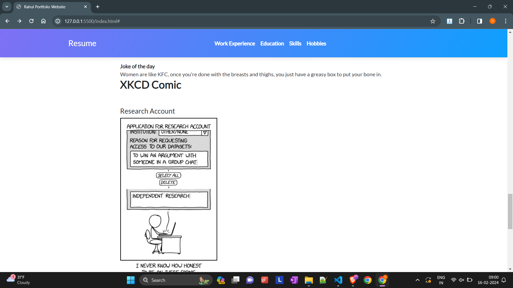

# WAPH-Web Application Programming and Hacking

## Instructor: Dr. Phu Phung

**Name**: Rahul Kumar Reddy Boggula

**Email**: boggula@ucmail.uc.edu

**Short Bio** :

Hi, This is Rahul. I am a MSIT student currently in my second semester at university of cincinnati. I am very much intrested in bulding stuff especially web development. I plan to upgrade my skills in this domain and I feel this course WAPH will help me enhance and develop my skill in this domain and excel in the coming days


# Individual Project 1

## Front-end Web Development with a Professional Profile Website on github.io cloud service

## Repository Information

Respository's URL: [https://github.com/boggulry/boggulry.github.io](https://github.com/boggulry/boggulry.github.io)

## Overview and Requirements

In this project, I worked on building a individual portfolio website using a bootstrap template and javascript skills. This professional portfolio website is hsoted in the github.io cloud service which is provided by the github. In this, there is a navigastion bar in the top where it takes to the respective section of the resume like experience, education, skills, hobbies etc. For more additional features, Javascript is used in this for things like digital clock, analog clock, api integration like joke apis, dog api and cookies. alonside a page tracker is added using flagcounter website. The main index.html file contains all the code and it takes us to the waph.html page where the code for the course work done so far is present.

## General Requirements

The basic portfolio website is deployed in the github.io which can be viewed by anyone at boggulry.github.io which has all the sections required. Details like name, headshot, contact information, education, experience and skills are added in the page. This is a initial portfolio page for which all the additional features will be developed as we move further. more features will be added to this page using react, javascript to make it look more better and with more functionalities

link to the page : https://boggulry.github.io/


A link is added at the starting of the home page with the caption "Click here to view Web Application Programming and Hacking course" which has the overview of all the work done so far. In this the overview of each section that is completed so far is provided which gives an understanding about the overall course.


## Non Technical Requirements

An open source CSS bootstrap based portfolio is used in my portfolio which is enhanced by adding the navigation, page tracker and additional features. To make it more visible to the recruiters, i have highlighted my work experience and the work done at my previous companies. These sections include the work experience, education, skills and hobbies and when you click on these, it will take you to the respective sections. This helps the recruiters to navigate through my resume and look at the various sections which they wanted to look more.


Page tracker is added at the bottom of the webpage using Flag Counter Analytics. Here in this tracker, it tracks the number of people visited the home page along with the country from which they visited the page and the time and device used to visit the page can be viewed in the link provided by them


```html
<div>
  <a href="https://info.flagcounter.com/PEIY"
    ></a>
</div>
```


## Technical Requirements

### Basic Javascript code

After the hobbies tab, basic javascript code is used to include the analog clock, digital clock, show my email functionalities which are done in the lab 2 are added to the portfolio website in which jquery is used. Along with this, a new feature of the contact me is used in which an open source js library react is used. This additional feature uses a contactform.js file which i react dom is used to render the information provided by the people who visit the home page.

for this the react dependencies like babel and others are included in the meta tag of the html page. the screenshot that demonstrates the functionality is shown below.


```js
// In your contactform.js file

const ContactForm = () => {
  const handleSubmit = (event) => {
    event.preventDefault();
    // You can add your form submission logic here, such as sending data to a backend server
    alert("Form submitted!");
  };

  return (
    <form onSubmit={handleSubmit}>
      <h2>Contact Me</h2>
      <div>
        <label htmlFor="name">Name:</label>
        <input type="text" id="name" name="name" required />
      </div>
      <div>
        <label htmlFor="email">Email:</label>
        <input type="email" id="email" name="email" required />
      </div>
      <div>
        <label htmlFor="message">Message:</label>
        <textarea id="message" name="message" required></textarea>
      </div>
      <button type="submit">Submit</button>
    </form>
  );
};

ReactDOM.render(<ContactForm />, document.getElementById("root"));
```


### Two Public APIs integration

Two joke apis are used in this index.html page. the first one is the https://v2.jokeapi.dev/joke/Any in which any random joke is displayed on the page and it refreshes automatically every 1 min. additionally XKCD joke api is also used to display the graphic images in the webpage. Both the apis are illustrated in the below ss and the code for the respective public apis is given below

the code for the XKCD joke api :

```js
// Function to fetch XKCD comic data
function fetchXKCDComic() {
  // Use the cors-anywhere proxy to bypass CORS issues during development
  const proxyUrl = "https://api.allorigins.win/raw?url=";
  const apiUrl = "https://xkcd.com/info.0.json";

  // Fetch data from XKCD API through the proxy
  fetch(proxyUrl + apiUrl)
    .then((response) => response.json())
    .then((data) => {
      // Update the HTML elements with XKCD comic data
      document.getElementById("xkcd-title").textContent = data.title;
      document.getElementById("xkcd-img").src = data.img;
      document.getElementById("xkcd-alt").textContent = data.alt;
    })
    .catch((error) => {
      console.error("Error fetching XKCD comic:", error);
    });
}

// Fetch XKCD comic on page load
fetchXKCDComic();
```

code for the regular joke api that refreshes automatically for every 1 min:

```js
/ Function to fetch and display a joke
      function fetchJoke() {
                        fetch('https://v2.jokeapi.dev/joke/Any')
                            .then(response => response.json())
                            .then(data => {
                                // Check if the joke is a single joke or a setup and delivery
                                const joke = data.type === 'single' ? data.joke : `${data.setup}<br>${data.delivery}`;
                                // Display the joke
                                document.getElementById('joke').innerHTML = joke;
                            })
                            .catch(error => {
                                console.error('Error fetching joke:', error);
                            });
                    }

                    // Fetch a joke immediately when the page loads
                    fetchJoke();

                    // Fetch a new joke every 1 minute
                    setInterval(fetchJoke, 60000);
```



```js
fetch("https://dog.ceo/api/breeds/image/random")
  .then((response) => response.json())
  .then((data) => {
    const dogImage = document.getElementById("dog-image");
    dogImage.src = data.message;
  })
  .catch((error) => console.error("Error fetching data:", error));
```


When ever the page is refreshed, a dog image will be displayed using the (https://dog.ceo/dog-api/) dog api. it is interesting to have the open sourced public apis to use in the portfolio website which adds an extra fun to the people who visit the page

### Integration of cookies

two functions are added getcookie() and setcookie() which are used to display the message on the homepage. To make the user experience more clear about their last vistits, when a user comes to the page for the first time, they are greeted with the "welcome to my home page" and when they visit the page again, they will be greeted with the same page along with the cookie that is the time of the last visit which will help them understand when they visited the page last time.


```js
<div id="welcome-message"></div>;

// Function to display welcome message based on cookie
function displayWelcomeMessage() {
  var lastVisit = getCookie("lastVisit");

  if (!lastVisit) {
    // First time visit
    setCookie("lastVisit", new Date(), 365); // Store the current date for future visits
    document.getElementById("welcome-message").textContent =
      "Welcome to my homepage!";
  } else {
    // Returning visit
    document.getElementById("welcome-message").textContent =
      "Welcome back! Your last visit was " + lastVisit;
  }
}

// Display welcome message on page load
displayWelcomeMessage();
```

## Submission

**pandoc** is used to generate the pdf report for submission from the **README.md** file for the lab 1. I made sure all the content is rendered properly. The PDF file is named as boggulry-waph-lab1.pdf
